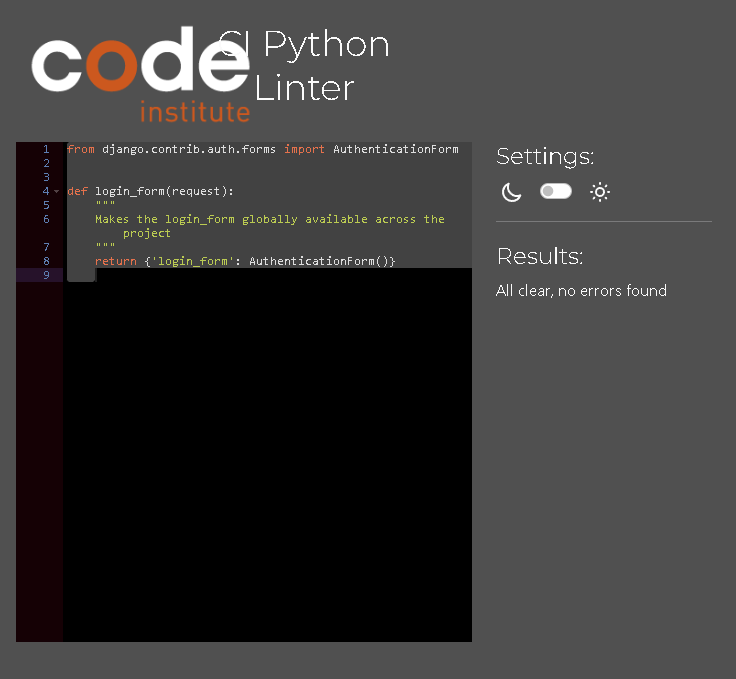

# Testing

## Difficult to solve bugs

When implementing my login modal I experienced problems with my modal. It was appearing behind the modal backdrop. In the documentation Bootstrap stipulates modals tend to act differently when placed into fixed components hence the issues.

I fixed this problem by taking the modal code out of the header and placing it at the bottom of the body. I also set a z-index for both the modal and modal backdrop as an extra defensive measure.

## Validator testing

### HTML validator

Testing tool - [W3C HTML Validation website]

I validated all pages across my website, everything was successful and **passed**! 

[Home page](https://validator.w3.org/nu/?showsource=yes&doc=https%3A%2F%2Fember-and-ash-58ab64713078.herokuapp.com%2F) - Passed

[Signup page](https://validator.w3.org/nu/?showsource=yes&doc=https%3A%2F%2Fember-and-ash-58ab64713078.herokuapp.com%2Faccounts%2Fsignup%2F) 
- 1 error displays which is a Duplicate ID error. This can be ignored as there is no conflict here. 1 of the ID's is the signup form, the other is from the login modal which is in the base.html therefore available to every page. The ID attributes of these elements are injected in with Django and allauth and CANNOT be changed

[Booking page](https://validator.w3.org/nu/?showsource=yes&doc=https%3A%2F%2Fember-and-ash-58ab64713078.herokuapp.com%2Fbooking%2F) - Passed

[Main menu page](https://validator.w3.org/nu/?showsource=yes&doc=https%3A%2F%2Fember-and-ash-58ab64713078.herokuapp.com%2Fmenu%2F) - Passed

[Lunch page](https://validator.w3.org/nu/?showsource=yes&doc=https%3A%2F%2Fember-and-ash-58ab64713078.herokuapp.com%2Fmenu%2Flunch_menu%2F) - Passed

[Dinner page](https://validator.w3.org/nu/?showsource=yes&doc=https%3A%2F%2Fember-and-ash-58ab64713078.herokuapp.com%2Fmenu%2Fdinner_menu%2F) - Passed

[My profile page](https://validator.w3.org/nu/?showsource=yes&doc=https%3A%2F%2Fember-and-ash-58ab64713078.herokuapp.com%2Fmy_profile%2F) - Passed

[Logout page](https://validator.w3.org/nu/?showsource=yes&doc=https%3A%2F%2Fember-and-ash-58ab64713078.herokuapp.com%2Faccounts%2Flogout%2F) - Passed

403 page - Did not check, main 404 error page was checked however I left the other error pages out. Attempting to check these was taking way too much time which would take me out of the scope of this project and django security made it very hard to invoke these error pages.

404 page - Passed

405 page - Did not check, main 404 error page was checked however I left the other error pages out. Attempting to check these was taking way too much time which would take me out of the scope of this project and django security made it very hard to invoke these error pages.

500 page - Passed

### CSS validator

I ran my CSS validation using [Jigsaw W3](https://jigsaw.w3.org/css-validator/)

Since I am not embedding any styles and I am using bootstrap classes for any inline styles (All bootstrap styles are standardized and tested already), there is no need to do multiple tests. The only necessary test here is directly testing the stylesheet. **Passed**

[CSS file](https://jigsaw.w3.org/css-validator/validator?lang=en&profile=css3svg&uri=https%3A%2F%2Fember-and-ash-58ab64713078.herokuapp.com%2Fstatic%2Fcss%2Fstyle.css&usermedium=all&vextwarning=&warning=1) - Passed

### JSHint validator

I validated my JS filed with [JSHint](https://jshint.com/)

All javascript files **passed** with no issues!

[booking.js]() - Passed

- All warning were just to inform that the features are for ES6+

- The undefined bootstrap in this js file is obviously bootstrap, this is the modal which is declared on line 5

[login.js]() - Passed

- All warning were just to inform that the features are for ES6+

- One warning states the body of a for in should be wrapped in an if statement to filter unwanted properties from the prototype. This in fact is wrapped within the *else* block of an if statement to filter what is needed and not needed.

[menu.js]() - Passed

- All warning were just to inform that the features are for ES6+

### Python validation

booking/admin.py

booking/apps.py

booking/forms.py

booking/models.py

booking/tests.py

booking/urls.py

booking/views.py

ember_ash/asgi.py

ember_ash/context_processors.py

ember_ash/middleware.py

ember_ash/settings.py

ember_ash/urls.py

ember_ash/views.py

ember_ash/wsgi.py

menu/admin.py

menu/apps.py

menu/forms.py

menu/models.py

menu/tests.py

menu/urls.py

menu/views.py

user/admin.py

user/apps.py

user/models.py

user/tests.py

user/urls.py

user/views.py

## Lighthouse testing

I used [Chrome lighthouse](https://developer.chrome.com/docs/lighthouse/overview) to lighthouse my project. Initially I had some problems with security of cloudinary sending http instead of https and duplicate id's from the signup page. After fixing these issues I had very high scores all across the board, near perfect. Only area where I really lost points was lack of contrast ratio between the foreground content of my page and the background. I left this as is as I dont want to disrupt the styling of the page by adding extra font weight, this would change the look and feel of the page quite a lot and take attention away from where we want the users to actually be looking.

Home page  - Passed

Signup page - Passed

Booking page - Passed

Main menu page - Passed

Lunch page - Passed

Dinner page - Passed

My profile - Passed

Signout page - Passed

403 page - Did not check, main 404 error page was checked however I left the other error pages out. Attempting to check these was taking way too much time which would take me out of the scope of this project and django security made it very hard to invoke these error pages.

404 page - Passed

 

405 page - Did not check, main 404 error page was checked however I left the other error pages out. Attempting to check these was taking way too much time which would take me out of the scope of this project and django security made it very hard to invoke these error pages.

500 page -  Did not check, main 404 error page was checked however I left the other error pages out. Attempting to check these was taking way too much time which would take me out of the scope of this project and django security made it very hard to invoke these error pages.

## Manual testing

### Responsiveness

For my responsiveness testing I used the app [Responsively app](https://responsively.app/)

Initially I had a problem with the my profile page on mobile but that was an easy fix and no further problems

|Screen Size|Device Type|Viewport Width|Pass/Fail|
|-----------|-----------|--------------|---------|
|Mobile|Smartphone|375px| ✅ Passed |
|Tablet|Tablet |768px| ✅ Passed |
|Laptop|Small Laptop/Desktop|1024px| ✅ Passed |

### Browser testing

I tested my deployed app on these browsers.

|Browser|Not Functioning|Partial Functioning|Full Functioning|
|-------|---------------|-------------------|----------------|
|<i class="fab fa-chrome"></i>Google Chrome| | |✅ Passed|
|<i class="fab fa-firefox-browser"></i>Mozilla Firefox| | |✅ Passed|
|<i class="fab fa-edge"></i>Microsoft Edge| | |✅ Passed|

### Website testing

Header & Navbar
| Feature | Expected Outcome | Testing Performed | Result | Pass/Fail/Potential improvements |
|---------|-------------------|-------------------|--------|-----------|
|Navigation links|On initial open of the page the navbar is immediately visible to the user|Open webpage on incognito|Navbar is visible|✅ Passed|
|Navbar|The navbar is visible regardless of which page and where you are on these pages|Load different pages and scroll down|Navbar is visible|✅ Passed|
|Company logo|The company logo stands out|Visual check|Company logo stands out|✅ Passed|
|Company logo|The logo leads to the homepage on click|Clicked the logo on a page other than home|Company logo link works|✅ Passed|
|Nav links|There is a home link which leads to the home page on click|Home button clicked from another page|Link works|✅ Passed|
|Nav links|There is a menu link which leads to the main menu page|Click the menu link from another page|Link works|✅ Passed|
|Nav links|There is a Make a Booking CTA that leads to the Booking page on click from another page IF the user is logged in|Click the Make a Booking CTA|User redirected|✅ Passed|
|Nav links|There is a Make a Booking CTA that doesn't link to the Booking page if the user is not logged in|Make sure we are logged out and click|Link didnt work|✅ Passed|
|Nav links|If the user is not logged in and clicks the make a booking they get a feedback error message that they must first login|Make sure we are not logged in and click the Booking CTA|Message appeared|✅ Passed|
|Nav links|The Booking CTA stands out and is eyecatching|Visual check of the Booking CTA and check it is underlined to make it stand out from the other buttons|Booking CTA stood out|✅ Passed|
|Nav links|The CTA underline transition disappears on hover|Hover mouse over Booking CTA|Underline disappeared|✅ Passed|
|Nav links|The Booking CTA gets transitions an underline again after mouse exits hover|Hover over Booking CTA and then remove the mouse from hovering|Underline reappeared|✅ Passed|
|Nav links|On smaller devices the navigation collapses into an expandable navigation|Window resize|Navigation links replaced with hamburger icon|✅ Passed|
|Hamburger icon|On click the navigation items display|Click icon|Nav links appears|✅ Passed|
|Hamburger icon|If opened, on click the navigation items disappear|Click the icon after opening|Nav links disappeared|✅ Passed|
|Login and Logout button|There is a login button on the right of the nav if the user is not logged in|Visual check|Login link present|✅ Passed|
|Login and Logout button|The login button is underlined to stand out|Visual check|Login button underlined|✅ Passed|
|Login and Logout button|The login button underline transition removes on hover|Hover mouse over|Underline disappears|✅ Passed|
|Login and Logout button|The login button underline transitions back on mouse exit after hover|Hover mouse over|Underline reappears|✅ Passed|
|Login and Logout button|On click of the login button the login modal is opened|Click button|Login modal appears|✅ Passed|
|Login and Logout button|On login of the user the login button changes to a logout button|Login and see if the button changes|Login link is replaced with logout link|✅ Passed|
|Login and Logout button|On logout of the user the logout button changes back to the login button|Logout and check|Logout link replaced with login link|✅ Passed|
|Login and Logout button|The logout button has an underline to attract attention|Visual check|Underline is present|✅ Passed|
|Login and Logout button|The logout button on hover transition removes the underline|Hover mouse over|Underline removed|✅ Passed|
|Login and Logout button|The logout button on mouse exit after hover regains the underline|Hover mouse over then mouse exit|Underline reappears|✅ Passed|
|Login and logout button|One link or the other is always present even on smaller devices|Visual check|Links are present on all screen sizes|✅ Passed|
|Regular nav links|Have no underline |Visual check|Regular links are not underlined|✅ Passed|
|Regular nav links|Transition underline on hover|Hover mouse over|Link underlines appear|✅ Passed|
|Regular nav links|Transition remove underline on mouse exit|Hover mouse over then mouse exit|Underlines disappeared|✅ Passed|
|My profile icon|On login the my profile icon is found on the left of the navbar|Visual check|Icon is present|✅ Passed|
|My profile icon|If not logged in the my profile icon is not present|Log out and check if the my profile icon is present|Icon is not present|✅ Passed|
|My profile icon|If logged in clicking the my profile icon leads the user to the my profile page|Login and click the my profile icon|User is redirected to the my profile page|✅ Passed|
|My profile icon|If logged in the icon is always present even on smaller devices|Visual check|Icon is present|✅ Passed|
|Button, anchor links, logo and my profile icon|On hover over any of these links the mouse become a pointer|Hover over links, buttons and icon|Mouse becomes pointer on hover|✅ Passed|
|Responsive|The navbar looks good and functions on many screen sizes|Window resize|Looks good|✅ Passed|
|Spelling check|There are no spelling errors in any of the links or the company logo within the nav|Read through links and company logo|No spelling errors, all capitalised correctly|✅ Passed|
|Active|If a user is on a page an active class is added and the text or icon changes thickness or color|Go to pages and check icon or link|Active classes work as intended|✅ Passed|

Footer
| Feature | Expected Outcome | Testing Performed | Result | Pass/Fail/Potential improvements |
|---------|-------------------|-------------------|--------|-----------|
|Responsive|Information displays well on multiple devices|Window resize|Footer resizes where appropriate|✅ Passed|
|Social media links |Each link opens the right page|Click links|Links open correct page|✅ Passed|
|Social media links|Each links open the page on a new tab|Click links|Links open on a new tab|✅ Passed|
|Footer availability|Footer is displayed on every page|Check the bottom of each page|Footer is available on each page|✅ Passed|

Home page
| Feature | Expected Outcome | Testing Performed | Result | Pass/Fail/Potential improvements |
|---------|-------------------|-------------------|--------|-----------|
|Hero img responsiveness|The hero image looks good on multiple screen sizes|Window resize|Image expands and constricts|✅ Passed|
|Images alt|Images contain alt tags|Check alt tags in console|Alt tags are present|✅ Passed|
|Navigation cards|Cards are responsive and display well on multiple screen sizes|Window resize|Cards adjust and fit well on different screen sizes|✅ Passed|
|Navigation cards links|On click of the navigation cards these link to the correct website page|Click navigation cards|All cards link to the appropriate page|✅ Passed|
|Review Navigation card |Opens tripadvisor on another tab|Click review navigation card|Tripadvisor opens on a new tab|✅ Passed|
|Navigation cards(Menu and booking)|Redirect to the appropriate page|Click navigation cards|Current page redirects to the appropriate page|✅ Passed|

My profile page
| Feature | Expected Outcome | Testing Performed | Result | Pass/Fail/Potential improvements |
|---------|-------------------|-------------------|--------|-----------|
|Profile icon|Users who are not logged in cannot see this icon leading to the my profile page|Log out and check nav|Icon is not visible|✅ Passed|
|Profile icon|Users who are logged in can see the my profile icon|Login and check nav|Icon is present|✅ Passed|
|My profile page|My profile page opens on click of profile icon|Click profile icon|Page opens|✅ Passed|
|My Bookings|Any bookings I previously made and have not deleted are displayed|Check bookings|Bookings display|✅ Passed|
|My bookings|Any bookings I will make will display in my bookings|Make a booking and check my bookings|Bookings made appear|✅ Passed|
|My bookings|Any bookings I make will immediately reflect in my bookings|Open 1 tab of my profile, open 1 tab and make a booking, then refresh the my profile tab |Bookings immediately appear|✅ Passed|
|My bookings data|Each booking displays the booking date, time, guests and comments|Check each booking|Correct information displays|✅ Passed|
|My bookings data|Bookings are displayed in order of farthest in the future first and farthest in the past last|Check booking dates order|Bookings are ordered correctly||✅ Passed
|Booking edit|Each booking has an edit icon present|Check bookings|Icons are present on each booking|✅ Passed|
|Booking edit|Each booking edit icon can be clicked to redirect to edit booking page|Click edit icon|Icons work|✅ Passed|
|Edit booking page|After redirection to edit page, information that was present on the booking is pre-filled on the edit form|Click edit icon, check inputs|Information is present|✅ Passed|
|Edit booking page|After editing a booking and submitting the data is immediately reflected in the booking in the my bookings|Edit a booking then check my bookings|Data immediately reflects|✅ Passed|
|Edit booking message|After editing a booking and submitting a success message is displayed|Edit a form and submit then Check if message displays|Success message displays|✅ Passed|
|Edit booking redirect|After editing a booking and submitting, user is redirected to the home page|Edit a booking and submit|Page redirects|✅ Passed|
|Edit booking|On click of a booking on the day or before the user is not directed to the edit page|Click edit on a booking in the past or current day|Page does not redirect|✅ Passed|
|Edit booking|On click of a booking on the day or before the user is displayed an error message|Click edit on a booking in the past or current day|Error message displays|✅ Passed|
|Delete booking Icon|On each booking item a delete booking icon is present|Check bookings|Icon is present on each booking|✅ Passed|
|Delete booking|On click of the delete booking icon a confirmation modal opens|Click delete icon|Modal opens|✅ Passed|
|Delete booking confirmation modal|On click of close the modal closes|Click Close|Modal closes|✅ Passed|
|Delete booking confirmation modal|On click of x the modal closes|Click x|Modal closes|✅ Passed|
|Delete booking confirmation modal|On click of Delete the modal closes(because of page refresh)|Click delete|Modal closes|✅ Passed|
|Delete booking confirmation modal|On click of Delete the booking is deleted, if dates are far enough in the future|Click delete|Booking is deleted|✅ Passed|
|Delete booking confirmation modal|On click outside of the modal the modal closes|Click outside of modal|Modal closes|✅ Passed|
|Delete booking confirmation modal|On open of modal, the background greys out|Click delete icon|Background greys out|✅ Passed|
|Delete booking modal|If a user attempts to delete a booking from the past or on the same day as the booking the page just refreshes and does not delete the modal|Click the delete button|Booking is not deleted|✅ Passed|
|Delete booking modal|If a user attempts to delete a booking from the past or on the same day as the booking an error message is displayed|Click the delete button|Message displays|✅ Passed|
|Pagination|If there is more than 5 bookings pagination activates and displays 2 pages at the bottom|Create more than 5 bookings and check my profile page|Pagination works|✅ Passed|
|Pagination|If there is more than 5 bookings pagination activates and displays a next page if there is a next page|Check if next page is present|Next page is present|✅ Passed|
|Pagination|If there is more than 5 bookings pagination activates, on click of next page the user is redirected to the next page|Click next page|Next page link works|✅ Passed|
|Pagination|If there is more than 5 bookings pagination activates, on click of previous page the user is redirected to the previous page|Click previous page|Previous page redirection works|✅ Passed|
|Pagination|If there is more than 1 page pagination displays a counter of pages and shows which page you are on|Check bottom of page|Page counter works |✅ Passed|

Menu page
| Feature | Expected Outcome | Testing Performed | Result | Pass/Fail/Potential improvements |
|---------|-------------------|-------------------|--------|-----------|
|Meal cards|Meal cards are displayed|Visual check|Meal cards are displayed correctly|✅ Passed|
|Meal cards|When clicking anywhere on the card, navigate to their respective page|Click cards|Navigation works wherever you click|✅ Passed|
|Meal cards responsiveness|Each card remains the same size on multiple screen sizes|Screen resize|Both cards are the same size across multiple devices|✅ Passed|
|Add menu icon|Clicking the add menu item icon, navigates the user to the add menu item form|Click the + icon|User is redirected to the add menu item form page|✅ Passed|
|Add menu icon|Admins can see an add menu icon|Login to an admin account and check|Icon is visible to admins |✅ Passed|
|Add menu icon|Regular users cannot see an add menu icon|Login to a normal user account and check|Icon is not visible to regular users|✅ Passed|

Add item page 
| Feature | Expected Outcome | Testing Performed | Result | Pass/Fail/Potential improvements |
|---------|-------------------|-------------------|--------|-----------|
|Add menu item|All form fields are required( If user skip adding an image, it has a default in place therefore form will go through)|Test form fields|All fields require adding except image|✅ Passed|
|Add menu item|All form fields have a label|Visual check|Labels are present|✅ Passed|
|Add menu item|Images post to cloudinary and reflect on the item|Add an image and check added item|Cloudinary image connection works|✅ Passed|
|Add menu item|A meal category must be selected or the form cant submit|Dont select meal category and submit|Form does not submit|✅ Passed|
|Add menu item|If an item is added without an image being added the default image is added instead|Check image is added|Default image works|✅ Passed|
|Add menu item|If a user submits a valid form that data populates the database|Check if item is reflected in lunch or menu page|Data propagates to backend|✅ Passed|
|Title input|Any characters can be placed into the title|Type different characters and numbers etc|Different characters work|✅ Passed|
|Description input|Any characters can be placed into the description|Type different characters and numbers etc|Different characters work|✅ Passed|
|Image input|Users can select a file to be passed in|Add image|Image files can be passed in(Other file types cause an error page)|✅ Passed|
|Price input|Users can only add numbers|Type characters and numbers|Only numbers can be input|✅ Passed|
|Price input|Users cannot add more than 4 digits before the decimal point|Type numbers|4 digits is the maximum before the decimal|✅ Passed|
|Price input|Users cannot add more than 2 decimal digits|Type decimal digits|2 digits is the maximum after the decimal|✅ Passed|
|Price input|Users cannot add more than 4 digits before the decimal point and 2 decimal digits at the same time|Add digits before and after the decimal point|4 digits before and 2 after the decimal is the maximum amount of digits at once|✅ Passed|
|Meal category|Users can only select Lunch or Dinner|Attempt to type|Lunch a||
|Meal category|Users cannot manipulate the select data in the dev tools and submit successfully|Change select to input in dev tools and submit|Page does not successfully submit and displays an error| ✅ Passed |
|Unique title|Users cannot add a title which is already in use|Add a title which is already used|Form does not submit and error displays|✅ Passed|
|Submit button|If the form is filled out correctly on submission of the form the user is redirect back to the appropriate menu page, depending on if it is a lunch item or dinner item added|Fill out form and submit|Users are redirected to the appropriate page|✅ Passed|
|Submit button|If the form is not filled out correctly on submission of the for the user is not redirected to another page|Fill out form incorrectly and submit|User is not redirected|✅ Passed|

Lunch Menu page
| Feature | Expected Outcome | Testing Performed | Result | Pass/Fail/Potential improvements |
|---------|-------------------|-------------------|--------|-----------|
|Lunch menu items|Items on the page or only data-meal_category = lunch|Check if items are data-meal_category = lunch|Only lunch items are displayed|✅ Passed|
|Lunch menu items|All data is correct and displays properly|Check image, title, description, price|Data is correct and displays properly|✅ Passed|
|Lunch menu item image|If an image is not selected the default img appears instead|Check image|Default image is present where appropriate|✅ Passed|
|Menu item card responsiveness|Displays well on across screen sizes|Window resize|Item cards are responsive|✅ Passed|
|Menu item card responsiveness|Items are 2 per row on medium |Check items|@ appear per row|✅ Passed|
|Menu item card responsiveness|Items are 1 per row on small devices|Check items|1 appears per row|✅ Passed|
|Nav and footer|Nav and footer render correctly|Visual check|Nav and footer appear correctly|✅ Passed|
|Edit icon|Displays for admins|Visual check|Edit icons are present on each item|✅ Passed|
|Edit icon|Does not display for normal users|Visual check|Edit icon is not visible to normal users|✅ Passed|
|Edit icon|On click of the edit icon the user is redirected to the edit form page|Click the edit icon|User is redirected correctly|✅ Passed|
|Delete icon|Displays for admins|Visual check|Delete icons display for admin|✅ Passed|
|Delete icon|Does not display for regular users|Visual check|Delete icons are not visible|✅ Passed|
|Delete item confirmation modal|On click of the delete icon the delete confirmation modal appears |Click delete icon|Confirmation modal appears|✅ Passed|
|Delete item confirmation modal|On click of delete in the modal the item is deleted|Click the button and check|Item is deleted|✅ Passed|
|Delete item confirmation modal|On click of delete in the modal the user stays on the dinner page|Click the button and check|User remain on the same page|✅ Passed|
Image alt|Alt attribute is added automatically and is equal to the description|Check dev tool elements if alt is present|Alt is present|✅ Passed|

Dinner menu page
| Feature | Expected Outcome | Testing Performed | Result | Pass/Fail/Potential improvements |
|---------|-------------------|-------------------|--------|-----------|
|Dinner menu items|Items on the page or only data-meal_category = Dinner|Check if items are data-meal_category = Dinner|Only dinner menu items are present|✅ Passed|
|Dinner menu items|All data displays properly|Check image, title, description, price|Data displays properly|✅ Passed|
|Dinner menu item image|If an image is not selected the default img appears instead|Check image|Default appears|✅ Passed|
|Menu item card responsiveness|Displays well on across screen sizes|Window resize|Item cards are responsive|✅ Passed|
|Menu item card responsiveness|Items are 2 per row on medium |Check items|2 appear per row|✅ Passed|
|Menu item card responsiveness|Items are 1 per row on small devices|Check items|1 appears per row|✅ Passed|
|Nav and footer|Nav and footer render correctly|Visual check|They appear correclty|✅ Passed|
|Edit icon|Displays for admins|Visual check|Edit icon is present for each item|✅ Passed|
|Edit icon|Does not display for normal users|Visual check|Icon is not present for regular users|✅ Passed|
|Edit icon|On click of the edit icon the user is redirected to the edit form page|Click the edit icon|User is correctly redirected|✅ Passed|
|Delete icon|Displays for admins|Visual check|Icon is displayed for admins|✅ Passed|
|Delete icon|Does not display for regular users|Visual check|Icon is not available to regular users|✅ Passed|
|Delete item confirmation modal|On click of the delete icon the delete confirmation modal appears |Click delete icon|Modal appears|✅ Passed|
|Delete item confirmation modal|On click of delete in the modal the item is deleted|Click the button and check|Item is deleted|✅ Passed|
|Delete item confirmation modal|On click of delete in the modal the user stays on the dinner page|Click the button and check|User stays on the dinner page|✅ Passed|
|Image alt|Alt attribute is added automatically and is equal to the description|Check alt attributes in the dev tools |Alt attributes are added correctly|✅ Passed|

Login modal
| Feature | Expected Outcome | Testing Performed | Result | Pass/Fail/Potential improvements |
|---------|-------------------|-------------------|--------|-----------|
|Login link|On click it opens the login modal|Click link|Login modal opens|✅ Passed|
|Login modal|Username and password inputs are present|Visual check|Inputs are present|✅ Passed|
|Login modal|Image loads normally on left side on larger devices and on top on smaller devices |Visual check|Image loads correctly|✅ Passed|
|Login modal |If user fills out form incorrectly the page does not refresh|Fill out incorrectly and press login|Page does not refresh|✅ Passed|
|Login modal|If username is not filled out, an HTML validation warning appears|Dont fill in and submit|Warning displays|✅ Passed|
|Login modal|If password is not filled out an HTML validation warning appears|Dont fill in and submit|Warning displays|✅ Passed|
|Signup link|There is a signup link present which stands out |Visual check|Signup links is present|✅ Passed|
|Login modal error handling|Errors are not present on open of the modal|Open modal|Errors are not present|✅ Passed|
|Login modal error handling|If form is filled out incorrectly errors display|Fil out incorrectly and check errors|Error displays|🟧✔️ Partially Passed, error handling is working however the displayed error from Django isnt very specific. A future iteration should adjust this and give more specific error handling|
|Signup link|Link opens the signup page |Click link|Signup page opens|✅ Passed|

Signup page
| Feature | Expected Outcome | Testing Performed | Result | Pass/Fail/Potential improvements |
|---------|-------------------|-------------------|--------|-----------|
|Signup form|Signup form displays with username, email, password, confirm password inputs|Check page|Inputs are present|✅ Passed|
|Signup form error handling|Username required HTML validation works|Submit without filling in username|Validation works|✅ Passed|
|Signup form error handling|Email required HTML validation works|Submit without filling in Email|Validation works|✅ Passed|
|Signup form error handling|Email HTML validation works|Submit without Adding an @ sign|Validation works|✅ Passed|
|Signup form error handling|Password required HTML validation works|Submit without filling in Password|Valdiation works|✅ Passed|
|Signup form error handling|Password(again) required HTML validation works|Submit without filling in Password(again)|Validation works|✅ Passed|
|Signup form error handling|If password and password(again) are different the form does not submit|Add different passwords and submit|Validation works|✅ Passed|
|Signup form error handling|If password and password(again) are the same the form submits|Add the same passwords and submit|Submits correctly|✅ Passed|
|Signup submit|If the form is filled out correctly the form is submitted|Fill out correctly and submit|Submits|✅ Passed|
|Signup submit|If the form is filled out incorrectly the form is not submitted|Fill out incorrectly and submit|Form does not submit|✅ Passed|
|Form submission|If the form is filled out correctly and submitted, the user is automatically logged in and directed to the home page|Fill out the form and submit|User is logged in automatically|✅ Passed|

Logout page
| Feature | Expected Outcome | Testing Performed | Result | Pass/Fail/Potential improvements |
|---------|-------------------|-------------------|--------|-----------|
|Nav link|Logout nav link gets the active class and becomes bold|Go to logout page and check|Active class is present|✅ Passed|
|Sign out message|Sign out confirmation displays on the logout page|Go to logout page and visually check|Confirmation page displays|✅ Passed|
|Sign out button|Sign out button displays on the logout page|Go to the logout page and visually check|Button is present|✅ Passed|
|Sign out button|On click of the sign out button the user is signed out and directed to the home page|Press button and check|User is redirected correctly|✅ Passed|
|Sign out message|On user sign out the user is given a feedback message|Sign out and check if a message appears|Message is displayed|✅ Passed|

403 page
| Feature | Expected Outcome | Testing Performed | Result | Pass/Fail/Potential improvements |
|---------|-------------------|-------------------|--------|-----------|
|403 page|Nav and footer appears in the page|Invoke a 403 page error, check page||🟧Unable to open page, will revisit this in the future|
|403 page|403 error displays|Invoke a 403 page error, check page||🟧Unable to open page, will revisit this in the future|
|Home button|Home button appears in the page|Invoke a 403 page error, check page||🟧Unable to open page, will revisit this in the future|
|Home button redirection|On click the button redirects the user to the home page|Invoke a 403 page error, click the home button||🟧Unable to open page, will revisit this in the future|

404 page
| Feature | Expected Outcome | Testing Performed | Result | Pass/Fail/Potential improvements |
|---------|-------------------|-------------------|--------|-----------|
|404 page|Nav and footer appears in the page|Invoke a 404 page error, check page|Page displays|✅ Passed|
|404 page|404 error displays|Invoke a 404 page error, check page|Error heading displays|✅ Passed|
|Home button|Home button appears in the page|Invoke a 404 page error, check page|Button displays|✅ Passed|
|Home button redirection|On click the button redirects the user to the home page|Invoke a 404 page error, click the home button|Redirection works|✅ Passed|

405 page
| Feature | Expected Outcome | Testing Performed | Result | Pass/Fail/Potential improvements |
|---------|-------------------|-------------------|--------|-----------|
|405 page|Nav and footer appears in the page|Invoke a 405 page error, check page||🟧Unable to open page, will revisit this in the future|
|405 page|405 error displays|Invoke a 405 page error, check page||🟧Unable to open page, will revisit this in the future|
|Home button|Home button appears in the page|Invoke a 405 page error, check page||🟧Unable to open page, will revisit this in the future|
|Home button redirection|On click the button redirects the user to the home page|Invoke a 405 page error, click the home button||🟧Unable to open page, will revisit this in the future|

500 page
| Feature | Expected Outcome | Testing Performed | Result | Pass/Fail/Potential improvements |
|---------|-------------------|-------------------|--------|-----------|
|500 page|Nav and footer appears in the page|Invoke a 500 page error, check page||🟧Unable to open page, will revisit this in the future|
|500 page|500 error displays|Invoke a 500 page error, check page||🟧Unable to open page, will revisit this in the future|
|Home button|Home button appears in the page|Invoke a 500 page error, check page||🟧Unable to open page, will revisit this in the future|
|Home button redirection|On click the button redirects the user to the home page|Invoke a 500 page error, click the home button||🟧Unable to open page, will revisit this in the future|
